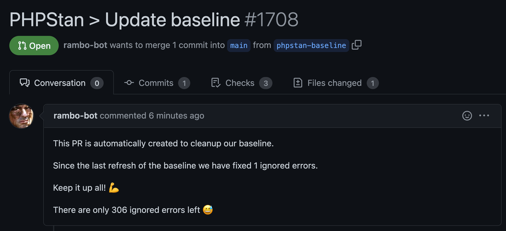

# Automatically refresh PHPStan baseline



```yaml
name: 'PHPStan'
on:
    # Every Wednesday we want to refresh the baseline
    schedule:
        -   cron: '0 6 * * 3'

    # We want to be able to manually refresh the baseline too
    workflow_dispatch:

    # Run PHPStan analyse on pull requests
    pull_request:

env:
    PHP_VERSION: 8.0
jobs:
    phpstan:
        runs-on: ubuntu-20.04
        steps:
            -   name: Checkout
                uses: actions/checkout@v2.3.4
            -   name: Setup PHP
                uses: shivammathur/setup-php@2.12.0
                with:
                    php-version: ${{ env.PHP_VERSION }}
                env:
                    fail-fast: true
            -   uses: ramsey/composer-install@1.3.0
            -   uses: ruudk/phpstan-baseline-refresh-create-pr-action@main
                with:
                    github_token: ${{ secrets.PAT_GITHUB_TOKEN }}
                    baseline_path: phpstan-baseline.neon
                    commit_name: Rambo
                    commit_email: rambo-bot@users.noreply.github.com
                    commit_message: PHPStan > Update baseline
                    pr_create: ${{ (github.event_name == 'workflow_dispatch' || github.event_name == 'schedule') && 1 || 0 }}
                    pr_title: PHPStan > Update baseline
                    pr_reviewer: ruudk
                    pr_body: |
                        This PR is automatically created to cleanup our baseline.

                        Since the last refresh of the baseline we have fixed {0} ignored errors.

                        Keep it up all! :muscle:

                        There are only {1} ignored errors left :sweat_smile:
```